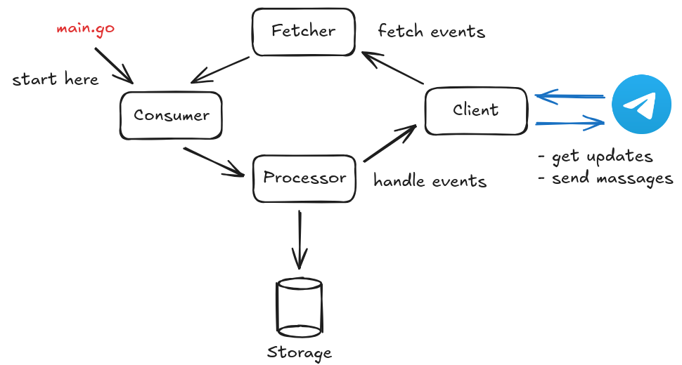

# PetManagerBot (Telegram)

A Telegram bot for creating and managing pet profiles.

## Available commands

| Command | Description |
|---|---|
| `/start` | Start (or restart) the bot and show a short welcome message |
| `/create_pet` | Create a new pet profile (typically a guided, step-by-step flow) |
| `/show_pet` | Show pet information (either a list of pets or a specific pet, depending on your implementation) |
| `/edit_pet` | Edit an existing pet profile (guided flow) |
| `/delete_pet` | Delete a pet profile (may ask for confirmation) |
| `/help` | Show the help message with the command list |
| `/break` | Cancel the current action / exit the current flow without saving |

## Features

- CRUD for pet profiles: create, read, update, delete
- Basic input validation: the bot checks user input before accepting it and asks the user to retry when input is invalid
- Command cancellation: send `/break` at any time during a multi-step interaction to cancel the current operation and return to the idle state

## Demo

➡️ [Watch on YouTube](https://youtube.com/shorts/XUhzaSAohgo?si=7Qyrv8qpDFaAQ4om)

## Architecture

The project follows a simple, explicit event‑processing pipeline for handling Telegram updates.

- **Client**  
  A thin wrapper around the Telegram Bot API

- **Fetcher**  
Fetches new events (updates) from the Client and turns them into a unified internal event stream

- **Consumer**  
  Entry point of the application. It wires components together and runs the main event loop:
    - pulls events from the Fetcher
    - forwards them to the Processor for handling

- **Processor**  
  Contains the core application logic:
    - routes events to the appropriate command handlers
    - uses Storage to persist data
    - uses Client to send replies back to Telegram

- **Storage**  
  Persistence layer used by the Processor to store and retrieve bot data

Data flow (simplified):

## Used technologies

- **FSM architecture**  
  The bot uses a finite state machine to manage multi‑step commands (such as creating a pet). Each user has its own state, which controls what kind of input is expected next and allows safe cancellation of any flow

- **Telegram Bot API**  
  Integration with the Telegram Bot API is used to:
  - receive updates (messages, commands, callback query)
  - send messages and show alerts
  - work with inline and reply keyboards to provide button‑based interactions instead of plain text input

- **SQLite3 database**  
  A lightweight SQLite3 database is used as persistent storage for pet profiles and related data. This keeps the project easy to run locally without external dependencies, while still providing proper relational storage

- **UUID**  
  The project uses UUIDs to generate stable identifiers for entities

- **Structured logging (by `slog`)**  
  Structured logging is used to produce machine‑parseable logs
